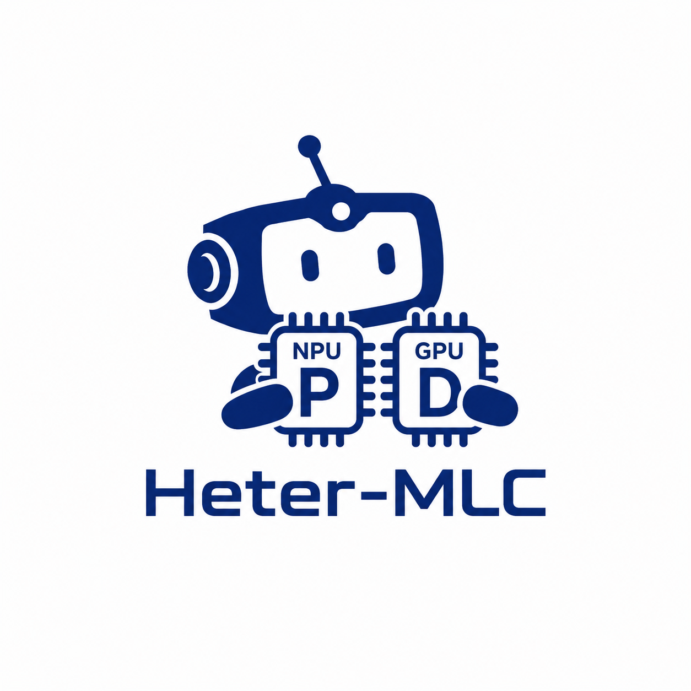

<p align="center">
  
</p>

# Heter-MLC

Heter-MLC is an open-source project for heterogeneous prefill/decode (PD) split
serving on top of **MLC-LLM**. It extends the MLC serving path so prefill can be
produced by an external accelerator while decode continues through the normal
MLC engine.

The core idea is simple: an external producer, such as CoreML/ANE on Apple
Silicon, produces prefill K/V tensors; Heter-MLC injects those tensors into
MLC's paged KV cache; MLC then continues decode on Metal through its normal
engine path. The result is a focused MLC extension for cross-accelerator
serving.

## What This Adds

- A paged-KV injection primitive, `DebugSetKV`, that writes externally produced
  K/V tensors into an existing sequence cache.
- An MLC serving data type, `ExternalKVData`, for backend-neutral K/V handoff.
- An MLC engine action, `PDExternalKVPrefill`, that reserves pages, injects K/V,
  seeds decode tokens, and hands control back to normal `BatchDecode`.
- A cleaned-up physical-position-map helper shared by debug KV paths.

## MLC Integration

Heter-MLC references an external MLC-LLM checkout instead of vendoring MLC
source. The current MLC integration is published as patch files:

- `patches/mlc-llm-pd-engine-action.patch`
  Apply from the root of an MLC-LLM checkout.
- `patches/tvm-debug-set-kv.patch`
  Apply from MLC's bundled `3rdparty/tvm` subtree.

Example layout:

```bash
git clone https://github.com/mlc-ai/mlc-llm.git
git clone https://github.com/YOUR_ORG/Heter-MLC.git

cd mlc-llm/3rdparty/tvm
git apply ../../../Heter-MLC/patches/tvm-debug-set-kv.patch

cd ../..
git apply ../Heter-MLC/patches/mlc-llm-pd-engine-action.patch
```

The patches are generated from the current development branches and may require
rebasing if upstream MLC-LLM has moved.

## Current Progress

The current implementation has been validated on the local Apple Silicon
development path:

- MLC-LLM build passes.
- `DebugSetKV` tests pass.
- Engine-level external-KV smoke passes on Qwen3-0.6B with exact two-token
  parity against a VM reference continuation.

The first public boundary is intentionally narrow: pure-text LLM serving,
single decode model, paged KV cache, and a Python-side external K/V producer.
CoreML/ANE stays outside the C++ engine as a producer boundary.

## Next Steps

Detailed planning is tracked outside this public package during early
development. For the public repo, the next work should be tracked as GitHub
Issues or a GitHub Project. The immediate items are:

- Add engine-action mock tests for `PDExternalKVPrefill`.
- Build a variable-length CoreML/ANE K/V producer.
- Run longer-sequence latency sweeps.
- Decide the stable public API name for the K/V injection primitive.
- Add deeper logit/KV-difference validation once sampler-side reporting is
  suitable.
